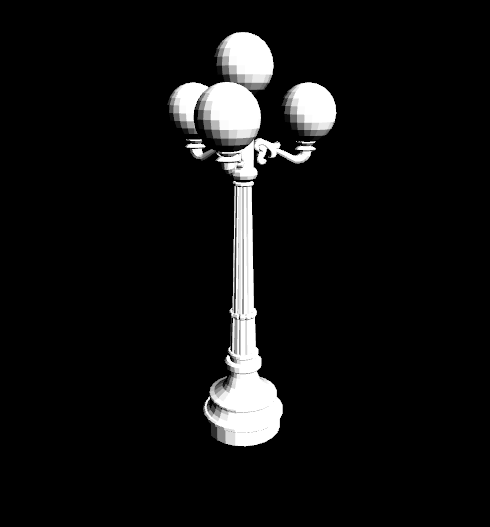

# OpenGLGameEngine
A Game Engine based on thehttp://in2gpu.com/category/game-development/opengl/ BaseEngine for simulation and other beautiful ideas.

=====Update 10/24/17=========
Custom models loading with .obj file is supported now. 

Next step:  
[11/06/2017] I am working on change the rendering method to deferred rendering.  
~~Event system and message handling.~~
